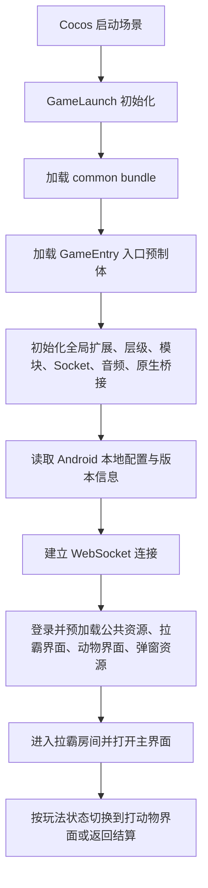
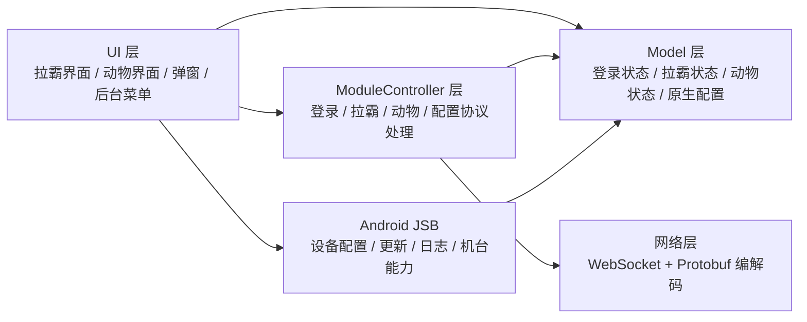
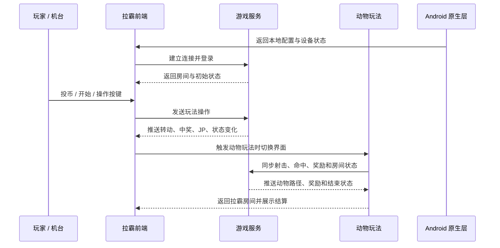

# lbjgame Showcase

> Cocos Creator Android 机台游戏前端展示仓库。原项目为私有商业项目，本仓库只公开脱敏后的项目说明、职责说明、架构流程图和展示素材，不公开源码、服务器配置、协议细节或真实运营数据。

## 项目简介

`lbjgame` 是一个基于 Cocos Creator 的 Android 机台游戏项目，核心形态是「拉霸机 + 打动物」联合玩法。项目运行在 Android 原生机台环境中，Cocos 前端负责 UI、动画、音效、资源加载、房间流转和协议状态处理，Android 原生层负责设备能力、配置读取、更新、网络、日志和机台相关能力。

这个公开仓库的目标不是让项目直接运行，而是让面试官在不接触私有源码的情况下理解项目复杂度、工程分层、我的负责范围，以及 AI / Codex 在旧项目理解和维护中的实际使用方式。

## 项目截图

### 启动加载


### 主游戏：麻将来了拉霸机


### 副游戏：打动物


## 技术栈

- Cocos Creator 2.4.x
- TypeScript
- Android JSB
- WebSocket
- Protobuf
- Cocos Bundle / Prefab / Animation / Audio
- Android 原生桥接与机台配置能力

## 我负责的内容

- 参与 Cocos 游戏前端业务开发，维护 UI、玩法流程、资源加载和协议状态处理。
- 维护拉霸主界面相关逻辑，包括余额、赢分、投币、退币、JP、警告、二维码等机台状态展示。
- 参与打动物玩法界面开发，处理炮台、动物路径、子弹、命中、奖励表现和房间切换流程。
- 对接 WebSocket + Protobuf 协议，处理登录、进入房间、开始游戏、服务端推送和结算展示。
- 参与 Android JSB 原生桥接流程，配合机台设备能力、配置读取、更新和异常上报。
- 使用 Codex 辅助梳理旧项目结构、启动链路、模块职责、崩溃风险和公开展示文档。

## 工程结构说明

以下是脱敏后的目录职责说明，只展示模块边界，不公开源码：

```text
assets/
  scene/             # 启动场景
  script/            # 最早加载的启动脚本与基础插件
  common/            # Cocos bundle：入口、框架、模块、模型、协议、管理器和业务脚本
  resources/         # 动态加载资源：UI、音频、动物、拉霸、特效、路径配置
  res/               # 图片、图集、字体、动画等美术资源
settings/            # Cocos Creator 项目与构建配置
packages/            # Creator 编辑器扩展工具
build/jsb-link/      # Android JSB 构建产物与原生工程
```

## 启动链路



## 模块分层



## 玩法流转



## AI / Codex 使用方式

- 梳理旧 Cocos 项目的启动链路、模块边界和关键风险点。
- 辅助定位崩溃风险，例如资源加载失败、定时器清理、错误上报频率、远程资源和 GPU 压力。
- 将私有项目 README、目录结构和职责说明整理成适合公开仓库的脱敏展示文档。
- 生成 Mermaid 架构图和流程图，用图示替代源码公开。

## 为什么不公开源码也能展示工程能力

- 项目包含前端 UI、动画、资源、协议、Android JSB、机台配置和长时间运行稳定性等多个工程面。
- README 展示了我对启动链路、模块职责、网络协议分层、原生桥接和玩法状态流转的理解。
- 对商业项目而言，保护源码、客户信息、真实配置和运营数据本身就是工程交付的一部分。
- 面试沟通时可以基于本文档讲清楚问题背景、负责范围、排查方式和维护思路。
